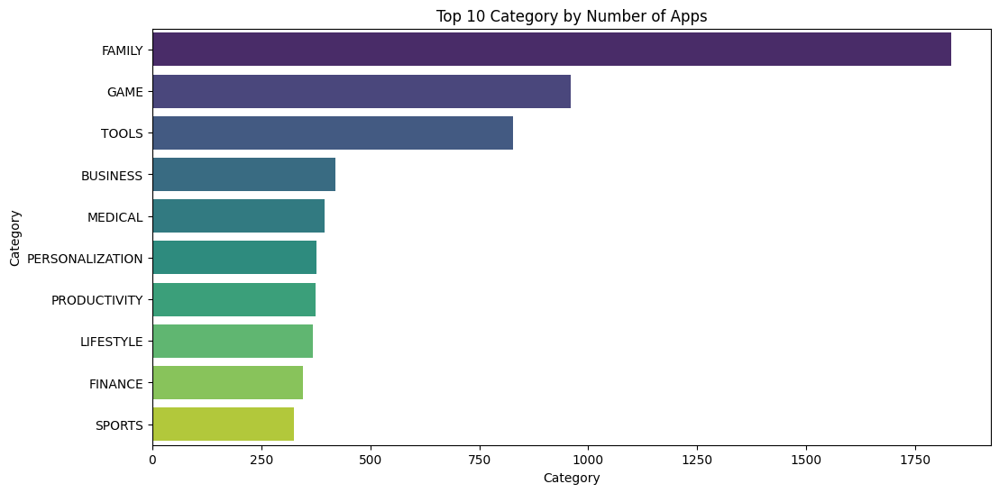
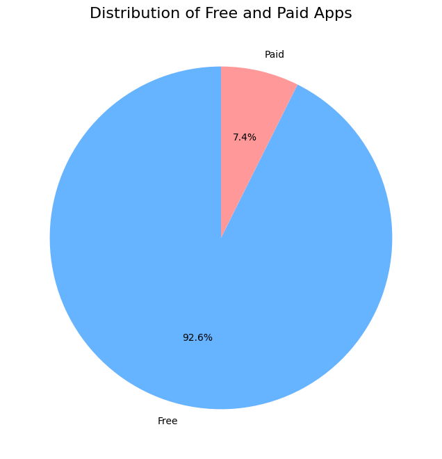
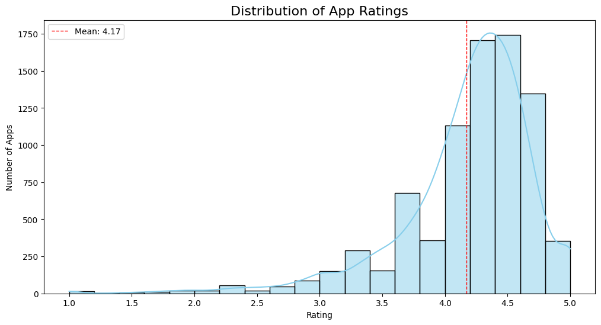
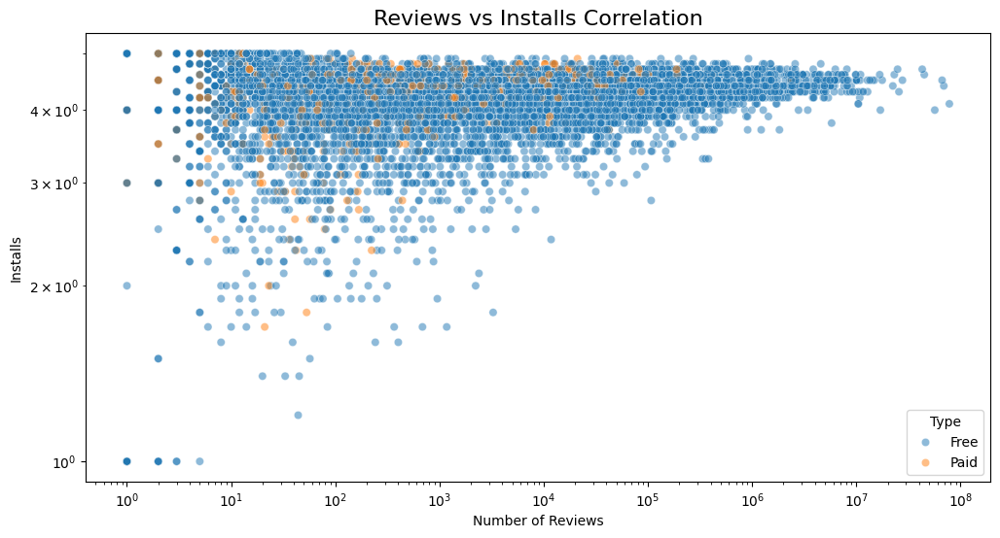
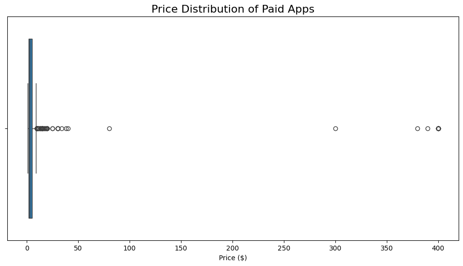

 # OIBSIP Task 2: Exploratory Data Analysis on Google Play Store Dataset

## 📊 Project Overview
This project performs Exploratory Data Analysis (EDA) on the Google Play Store dataset to identify trends and patterns related to app categories, ratings, pricing, and installs. The dataset contains information on over 10,000 Android applications collected from Kaggle. Using Python, the data was cleaned, analyzed, and visualized to generate meaningful business insights.

## 📁 Dataset
- **Source:** Kaggle – Google Play Store Dataset
- **Records:** 10,000+ Android apps
- **Final Size:** 9,366 rows × 13 columns

## 🔧 Steps Performed

### 1. Data Cleaning
- Removed 483 duplicate app records
- Filled missing values in the `Rating` column using the mean rating
- Converted `Installs`, `Price`, and `Size` columns into numeric format
- Removed one invalid row where `Category = '1.9'`
- Final cleaned dataset: 9,366 rows × 13 columns

### 2. Data Visualization
- *Top 10 App Categories* - Horizontal Bar Chart


- *Free vs Paid Apps Distribution* - Pie Chart  


- *App Rating Distribution* - Histogram with KDE


- *Reviews vs Installs Correlation* - Scatter Plot with Log Scale


- *Price Distribution of Paid Apps* - Box Plot


## 💡 Key Insights
1. **FAMILY** and **GAME** are the most popular app categories with 3000+ apps combined
2. Around **92.6% of apps are free**, while only **7.4% are paid**
3. The **average app rating is 4.17**, with most ratings between 4.0 and 4.5
4. Apps with more reviews generally have higher install counts - strong positive correlation
5. **75% of paid apps cost less than $5**, with a few expensive outliers up to $400

## 🛠️ Tools & Libraries Used
- **Python**
- **Pandas** - Data manipulation and cleaning
- **NumPy** - Numerical operations
- **Matplotlib** - Data visualization
- **Seaborn** - Statistical data visualization
- **Jupyter Notebook** - Interactive development

## 🚀 How to Run
1. Install the required libraries:
   ```bash
   pip install pandas numpy matplotlib seaborn jupyter

   
